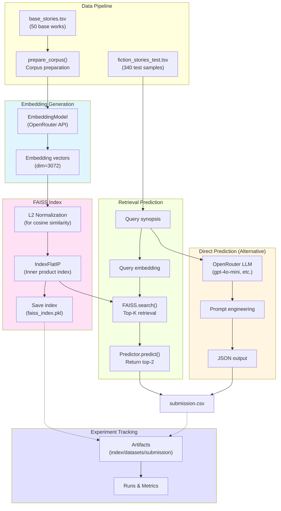

# signate-studentcup-2025 documentation!

## Description

https://user.competition.signate.jp/ja/competition/detail/?competition=385dcbba17b645f3ac10f827dfba03f6

## Commands

The Makefile contains the central entry points for common tasks related to this project.

## RAG System Architecture

### System Components

| Component | Description | Location |
|-----------|-------------|----------|
| **EmbeddingModel** | Unified interface for text embeddings using OpenRouter API | `features.py:96-117` |
| **build_faiss_index()** | Constructs FAISS vector index with L2 normalization | `features.py:122-206` |
| **retrieve_top_k()** | Performs top-K similarity search | `features.py:209-234` |
| **OpenRouterRetrievalPredictor** | Retrieval-based predictor using FAISS | `predict.py:37-73` |
| **OpenRouterDirectPredictor** | Direct LLM-based predictor | `predict.py:76-141` |

### Data Flow

1. **Training Phase** (`Predictor.fit()`):
   - Load `base_stories.tsv` (50 works)
   - Generate embeddings via OpenRouter API
   - Build FAISS IndexFlatIP with L2 normalization
   - Save index + log to W&B Artifacts

2. **Prediction Phase** (`Predictor.predict()`):
   - **Retrieval**: Embed query → FAISS search → Return top-2 IDs
   - **Direct**: LLM analyzes query with work list → Returns 2 IDs

3. **Output**: `submission.csv` with columns `[id, a, b]`

